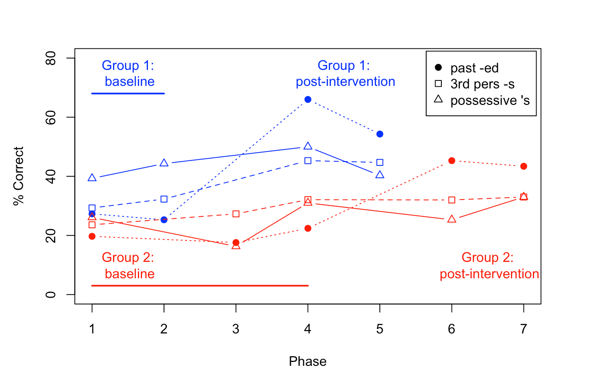

<!--- incorporating changes from Macartan Humphreys-->
<!--- incorporating analysis of raw data from Calder et al-->
<!--- have set Git credentials 12/12/21-->
```{r setup, include=FALSE}
knitr::opts_chunk$set(echo = TRUE)
#options(digits=2)
library(knitr)
library(kableExtra)
library(gridExtra)
library(DeclareDesign)
library(tidyverse)
library(fabricatr)
library(randomizr)
library(estimatr)
library(psych)
require(ROCit) #for ROC analysis
library("gridExtra")
library(cowplot)
library(MASS)
```

## Single case experimental designs (SCEDs)

In some disciplines, notably those where intervention is used with populations that are highly heterogeneous, single case experimental designs (SCEDs) are a set of procedures that are widely used in preference to randomised controlled trials (RCTs). At the extremes, these are radically different approaches to evaluating an intervention, using within-subjects versus between-subjects analyses respectively. The term 'single case' can be misleading; SCEDs are not case reports; they use experimental control and often involve more than one participant, creating a case series. The emphasis, however, is on individual outcomes rather than the group average. 

@best2019 compared the advantages and disadvantages of the two approaches, noting differences in cost and scale (substantially larger for RCTs), as well as different approaches to experimental controls - via use of a control group in RCTs, as opposed to contrasts between time periods or outcome measures in SCEDs. Best noted the differing conclusions that can be drawn from RCTs, where "If a difference between groups is found, this is in the group average; the intervention is not necessarily beneficial for all those that are treated", as opposed to SCEDs, where "The findings are applicable on a case by case basis and are analysed for each participant separately."  

This kind of weighing up of pros and cons of different experimental designs is precisely what DeclareDesign aims to do, within a formal framework that requires specification of the underlying assumptions of different approaches, and uses simulated data to compare them on a set of criteria specified by the researcher. The goal is to evaluate designs so that they can be optimised for a given research question. This becomes particularly interesting when one considers that the polarised distinction between RCTs and SCEDs is not absolute, and there is growing interest in combining aspects of the two approaches in hybrid designs.  

Here I aim to apply the MIDA approach of DeclareDesign to SCEDs. MIDA stands for Model, Inquiry, Data Strategy and Answer Strategy, with the first two elements being theoretical and the second two empirical. This way of conceptualising intervention studies is quite foreign to most researchers, who tend to focus simply on selecting a research design and analytic method. Its value, however, becomes apparent as soon as we look in detail at the comparisons of methods laid out by @best2019, because it allows us to categorise the different aspects of the two study types as belonging to specific parts of the overall research design.  

I will take as my starting point a study by @calder2021.  This is described as a RCT, but can be treated as a hybrid design that grew out of previous SCED studies by the authors on the same topic, evaluating an intervention to help language-disordered children use grammatical endings correctly. The design of the study can be grasped by showing the plot of mean scores for two groups.  

```{r calderfig,echo=F,eval=F,warning=F,message=F,fig.leg = "Mean % correct for two groups in Calder et al, 2021. Data plotted from Table 2."}
#Original plot created for intervention book

```

The study adopts a waitlist control design and contains two groups studied across 7 phases.  Both groups are initially assessed during a baseline period (Phases 1-2). Group 1 receives intervention during phase 3 and is then assessed again in phases 4 and 5. Group 2 continues untreated during phases 3-4, which count as an extended baseline, but is treated during phase 5, with post-intervention assessment during phases 6 and 7.  Assessment is made using three type of probe item.  
- Past tense -ed probes assess the grammatical morpheme that was trained in the intervention  
- 3rd person singular probes assess a related morpheme that is not trained by might be expected to show generalisation  
- Possessive 's probes assess untrained morphemes that are sufficiently different from the trained morpheme that they are not expected to show improvement. 

On each occasion, 30 probes of each kind were administered - these were subdivided according to the phonological form of the inflection, but we will not consider that aspect here.  

The design resembles a cross-over RCT, insofar as both groups receive intervention at different periods, first Group 1 and then Group 2, and Group 1 ceases intervention at the point when Group 2 starts it. However, unlike in a standard cross-over design, the expectation is that the effects of intervention will persist after the intervention ceases, so Group 1 is not anticipated to return to baseline levels.

The design also has elements of a SCED. There are two ways in which intervention effects can be estimated within subjects: first, by comparing the baseline and post-intervention periods; second, by comparing percentages correct on probes for trained items (past tense -ed) versus probes for unrelated untrained items (possessives). If intervention effects were simply placebo effects, we would expect to see gains on both item types.  

We will start by doing some simple statistical analyses on the raw data (kindly provided by Samuel Calder).  


```{r readrawdata,echo=F}
#Calder's data was reformatted using the readjslhr script, to create a .csv file with inflection type and group in long form.  NB One participant with no data at followup is excluded; also one measure of .111 was modified to .1, as .111 not compatible with 30 items.
calderdat <- read.csv('CalderRaw.csv')

#Note also that group 2 had 3 assessments pre intervention and 2 after, whereas group 1 had 2 before and 2 after. There was no indication of any improvement between sessions 1-2 for group 2, so comparison could be between their 1st 2 and last 2. 

#Here we create new columns with data recategorised according to time relative to intervention for the 2 groups
calderdat$pre1 <- calderdat$T1 #default is group 1
calderdat$pre2 <- calderdat$T2
calderdat$pre1[calderdat$group==2]<-calderdat$T3[calderdat$group==2]
calderdat$pre2[calderdat$group==2]<-calderdat$T4[calderdat$group==2]

calderdat$post1 <- calderdat$T4
calderdat$post2 <- calderdat$T5
calderdat$post1[calderdat$group==2]<-calderdat$T6[calderdat$group==2]
calderdat$post2[calderdat$group==2]<-calderdat$T7[calderdat$group==2]

# Now check correlation between the scores on -ed for 4 time points
w<-which(colnames(calderdat)=='pre1')
cormat <- cor(calderdat[calderdat$morph=='ed',w:(w+3)])
myr <- cormat[2,1] #correlation for -ed items is around .7
calderdat$premean<-(calderdat$pre1+calderdat$pre2)/2
calderdat$postmean<-(calderdat$post1+calderdat$post2)/2
calderdat$change <- calderdat$postmean-calderdat$premean

# Look at distributional properties of the measures for each morpheme for the average score pre and post intervention, and for change from pre to post.
caldersummary <- describeBy(calderdat[,15:17],group=calderdat$morph,mat=TRUE)
caldersummary

#For the trained morpheme, change is around 9 pts; for untrained it is 2-3 points.

#A more detailed summary broken down by timepoint and group - NB these means should look like those in the summary figure.
calderdat$groupmorph<-paste0('g',calderdat$group,calderdat$morph)
caldersummary2 <- describeBy(calderdat[,2:8],group=calderdat$groupmorph,mat=TRUE)
colnames(caldersummary2)[3:4] <- c('timepoint','nsub')
caldersummary2[,2:6]

#It turns out that on the -ed structure, everyone improves, so it's obvious even on a simple sign test. 
#On 3s 16/20 improve - so this is a more interesting one to consider in terms of whether one can identify the subset who improve (and distinguish from changes just due to random error)
#On poss 15/20 improve - but some get markedly worse. 

#Just checking if improvement seen within pre or post
calderdat$pre2.1 <-calderdat$pre2-calderdat$pre1
calderdat$post2.1 <-calderdat$post2-calderdat$post1

caldersummary3 <- describeBy(calderdat[,19:20],group=calderdat$morph,mat=TRUE)
caldersummary3

#No evidence of any gains between the two pre-test or two post-test sessions, except for pre on possessives

```
We can use this dataset to explore methods of analysis.  
A measure of effect size for individual participants has been proposed by Busk and Serlin in the context of doing meta-analyses of a series of single case studies [@ES_BS1992]. This is a conventional effect size, in which mean scores from the two phases (baseline and post-intervention) are subtracted and divided by a measure of standard deviation. The standard deviation can either be based just on the baseline phase or be a pooled estimate from both phases: these methods make different assumptions about similarity of variances across the two phases of study. As we have only two datapoints in a phase for some cases, we use here the second method for purely pragmatic reasons; this we term ES_BS. Busk and Serlin note that the expected distribution of this measure of effect size will depend on how far datapoints within and between phases are independent, and on whether the variance is equal across both phases. Using simulated data, we can explore what the distribution of ES_BS looks like under different assumptions.  

In the design of Calder et al we can also compute an ES_BS for each participant for the control measure, which is not expected to improve. This makes a stronger test because a particular pattern of results is expected. Furthermore, the pattern is expected to differ for the treated and untreated groups.

Here we adopt an underlying model that assumes that a proportion of cases, p, in the treated group improve, and we aim to use the ES_BS scores to categorise cases as treatment responders or non-responders. In the simplest case, all treated cases improve and none of the untreated cases improve, so p = 1. 

```{r functionbuskcompute}

#  Busk and Serlin's measure, d2
#    varpooled <-(apply(cbind(Y1_1,Y2_1),1,var)+apply(cbind(Y1_2_Z, Y2_2_Z),1,var))/2,
# NB I originally computed variances in separate steps but fabricatr doesn't like this, 
# hence v complicated formula here.

    makebusk <- function(myfile,mycols){
    Y1_1<-myfile[,mycols[1]]
    Y2_1<-myfile[,mycols[2]]
    Y1_2<-myfile[,mycols[3]]
    Y2_2<-myfile[,mycols[4]]
    busk <- ((Y1_2+Y2_2)-(Y1_1+Y2_1))/2/sqrt((apply(cbind(Y1_1,Y2_1),1,var)+apply(cbind(Y1_2, Y2_2),1,var))/2)

 return(busk)
}


```


```{r realanalysis,echo=F}
calderplay <- calderdat
calderplay$ES_BS1 <- NA #initialise
calderplay$row <-1:nrow(calderplay)

buskcut <- 1.5 #cutoff for deciding busk score indicates responder
#Value determined by trial and error as optimum for low false positive and high correct ID

myfile <- filter(calderplay,group==1)
mycols<-which(colnames(myfile) %in% c('T1','T2','T4','T5'))
buskvals <- makebusk(myfile,mycols) #run function defined above
calderplay$ES_BS1[myfile$row]<-buskvals

myfile <- filter(calderplay,group==2)
mycols<-which(colnames(myfile) %in% c('T1','T3','T4')) 
mycols[4]<-mycols[1] #we don't have 4 values so duplicate T1 here
buskvals <- makebusk(myfile,mycols) #run function defined above
calderplay$ES_BS1[myfile$row]<-buskvals

calderplay$ES_BS2 <- calderplay$ES_BS1 #just duplicate values - will overwrite just for group 2

mycols<-which(colnames(myfile) %in% c('T3','T4','T6','T7')) #myfile as before but now different cols
buskvals <- makebusk(myfile,mycols) #run function defined above
calderplay$ES_BS2[myfile$row]<-buskvals

require(yarrr)
calderplay$gp2 <- paste0(calderplay$morph,calderplay$group)
pirateplot(ES_BS1~group*morph,data=calderplay, main='Busk for 1st two intervals \n(only group 1 is treated)')
abline(h=1.5,lty=3)
pirateplot(ES_BS2~group*morph,data=calderplay,main='Busk for pre vs post treatment')
abline(h=1.5,lty=3)

#Also look at difference scores between morphemes.
calderplay$ed_3s<-NA
calderplay$ed_poss<-NA
calderplay$ed_3s[1:20] <- calderplay$change[1:20]-calderplay$change[21:40]
calderplay$ed_poss[1:20] <- calderplay$change[1:20]-calderplay$change[41:60]


```

For the binary categorisation of responder/non-responder, we need to identify an optimal cutoff on the ES_BS2 measure.  
One way to select this would be to do ROC analysis of all busk pre-post scores for the -ed and poss morphemes. 
```{r tryROCit}

calderroc <- calderplay[calderplay$morph != 's3',]
calderroc$Status <- as.factor(calderroc$morph)
calderroc$Status2 <- convertclass(x=calderroc$Status,reference='poss')
measure <- measureit(score=calderroc$ES_BS2,class=calderroc$Status2,
                     measure=c("ACC","SENS","FSCR"))
plot(measure$ACC~measure$Cutoff,type='l')

roc_empirical <- rocit(score=calderroc$ES_BS2,class=calderroc$Status2)
plot(roc_empirical)
ksplot(roc_empirical)
diff<-roc_empirical$TPR-roc_empirical$FPR
plot(roc_empirical$Cutoff,diff)
m<-max(diff)
w<-which(diff==m)
mycutoff <- roc_empirical$Cutoff[w]
print(paste('Optimal Cutoff on ES_BS2 = ',mycutoff))
```
We also computed an effect size for baseline/postintervention comparison of the control morpheme, possessive 's.  Here the prediction is that for both groups there should not be any change. Here we plot the ES_BS2 values for the treated vs control morpheme, for the comparison of pre- vs post-intervention. 
```{r makescatterfunction,echo=T}
makescatter<-function(scatterdat,myxlim1,myxlim2,mytitle){
  p<-ggplot(scatterdat, aes(x=scatterdat[,2], y=scatterdat[,3],  color=group)) +
  geom_point(size=4)+
  xlim(myxlim1,myxlim2)+
  ylim(myxlim1,myxlim2)+
  xlab(colnames(scatterdat)[2])+
  ylab(colnames(scatterdat)[3])+
  geom_abline(intercept = 0, slope = 1,  linetype="dotted")+
  geom_hline(yintercept=2,linetype="dashed",colour='red')+
  geom_vline(xintercept=2,linetype="dashed",colour='red')+
  geom_hline(yintercept=0,linetype="dotted")+
  geom_vline(xintercept=0,linetype="dotted")+
  geom_text(aes(label=subid),colour='black',size=4)+
  ggtitle(mytitle)
return(p)
}

```

```{r plotmorphemeES, echo=T}
#need to convert to wide form for scatterplot
wantcols <- c('ID','group','ES_BS1','ES_BS2')
scatterdat1 <- calderplay[calderplay$morph=='ed',wantcols]
scatterdat2 <- calderplay[calderplay$morph=='poss',wantcols]
scatterdat3 <- calderplay[calderplay$morph=='s3',wantcols]
scatterdat1<-cbind(scatterdat1,scatterdat2$ES_BS1,scatterdat2$ES_BS2,scatterdat3$ES_BS1,scatterdat3$ES_BS2)
colnames(scatterdat1)<-c('ID','group','ES_BS1_ed','ES_BS2_ed','ES_BS1_poss','ES_BS2_poss','ES_BS1_s3','ES_BS2_s3')
scatterdat1$group<-as.factor(2-scatterdat1$group) #reverse the order - makes it easier for coding later
levels(scatterdat1$group)<-c('N','T')
scatterdat1$subid <-sub(".", "", scatterdat1$ID)

#set same limits for x and y axis for all plots
myxlim1<-round(min(c(scatterdat1$ES_BS2_poss,scatterdat1$ES_BS2_ed)),0)-1
myxlim2<-round(1+max(c(scatterdat1$ES_BS2_poss,scatterdat1$ES_BS2_ed)),0)

 mytitle <- "Possessive (control) vs -ed (trained) effect size\nGroup T trained, Group N untrained"
c0 <- which(colnames(scatterdat1)=='group')
c1<-which(colnames(scatterdat1)=="ES_BS1_ed")
c2<-which(colnames(scatterdat1)=="ES_BS1_poss")
c3<-which(colnames(scatterdat1)=="subid")
scatterdat<-scatterdat1[,c(c0,c1,c2,c3)]
p1<-makescatter(scatterdat, myxlim1,myxlim2,mytitle)

mytitle <- "Possessive (control) vs -ed (trained) effect size\nBoth groups baseline vs post-intervention"
c1<-which(colnames(scatterdat1)=="ES_BS2_ed")
c2<-which(colnames(scatterdat1)=="ES_BS2_poss")
scatterdat<-scatterdat1[,c(c0,c1,c2,c3)]
p2<-makescatter(scatterdat, myxlim1,myxlim2,mytitle)

mytitle <- "3rd person singular (control) vs -ed (trained) effect size\nBoth groups trained on -ed"
c1<-which(colnames(scatterdat1)=="ES_BS2_ed")
c2<-which(colnames(scatterdat1)=="ES_BS2_s3")
scatterdat<-scatterdat1[,c(c0,c1,c2,c3)]
p3<-makescatter(scatterdat, myxlim1,myxlim2,mytitle)

mytitle<-"Effect size for -ed (trained)\nGroup N post-training vs pre-training"
c1<-which(colnames(scatterdat1)=="ES_BS1_ed")
c2<-which(colnames(scatterdat1)=="ES_BS2_ed")
scatterdat<-scatterdat1[scatterdat1$group=="N",c(c0,c1,c2,c3)]
p4<-makescatter(scatterdat,myxlim1,myxlim2,mytitle)

p_all <- plot_grid(p1, p4,p2,p3, labels=c("A", "B","C","D"), 
          ncol = 2, nrow = 2)
ggsave(plot = p_all, width = 6, height = 6, dpi = 300, filename = "Calder_plots.pdf")

```
We can see how the design of Calder et al allows us to scrutinise several sources of evidence for training effects. Panel A of the figure contrasts effect sizes for the -ed morpheme, which was trained, versus the possessive 's morpheme (a control morpheme) in group T (blue), who were trained specifically on -ed, and for group N (pink), who were not given any training over these two time periods. It can be seen that the pink points cluster in the bottom right quadrant, with effect sizes below 2 (shown as dashed red line) on both morphemes. According to Busk and Serlin, under reasonable assumptions, this effect size measure is distributed like a t-distribution, which would mean that a value of 2 would correspond roughly to a value that was significant at the 5% level on one-tailed test; i.e. a score this big is unlikely to have arisen by chance if the intervention had no true effect. In contrast most of the blue points (treated group) have ES values greater than 2 for the trained -ed construction, though three of them (subjects 12, 16 and 23) have values between 1 and 2. 

The picture for the untrained possessive morpheme is quite different. The dotted sloped line shows the point where the two types of morpheme show similar effect sizes, and it is clear that for group T, most participants have effect sizes falling well below that line. This pattern of performance is just what would be expected if the improvement associated with intervention was due to the specific training, and not a more general improvement that might reflect the child just getting familiar with the intervention set-up, or becoming more motivated.  There are however two participants in group T (5 and 9) who have an effect size greater than 2 on possessives as well as -ed constructions. For these participants, the evidence of an intervention effect looks much less compelling, because their improvement is non-specific.

Panel B shows the contrast between effect sizes obtained for two periods in group N. These ES values are not independent as they both involve a comparison with the baseline period, but ES_BS1 is measured during the phase when no intervention occurred (as shown also in panel A), whereas ES_BS2 is measured after intervention. These data also conform nicely to expectation, with only one participant (20) having a value less than 2 after intervention, though all of them score below this level in the pre-intervention period. 

In Panel C, the data for group T are identical to those in panel A, but we now see the ES after training for group N - both for the trained -ed morpheme and for the control possessive morpheme. We would expect that group N's data would now look more like group T's data, and this is generally the case, with effect sizes for the possessive remaining below 2, whereas those for the -ed morpheme are generally above 2 (as shown also for group N in panel B). Participants 3, 4 and 19 are exceptions, in that they also show improvement on the possessives, which is not anticipated given the intervention focus on -ed. 

In Panel D, data are similar to those in panel C, except that we now consider the third person singular morpheme on the Y-axis. Because this morpheme is similar to -ed, in that it involves inflecting a verb stem, it had been predicted that some children might show generalisation of learning. Four children, 1, 14, 19 and 22, showed improvement on both the third person singular and past tense -ed. Could this just be indicative of general improvement due to improved motivation or familiarity with the task? Some reassurance may be provided in cases where there was improvement on the third person singular but not on the possessive - this was the case for participants 1, 14 and 22. However, participant 19 improved on all three morpheme types, and so their results look more compatible with a general non-specific improvement, rather than a selective effect of intervention.

Overall, of the ten children in group N, six showed the kind of selective improvement with past tense morphemes that would indicate a genuine effect of intervention;  three showed improvement both on trained and untrained morphemes that suggested a generalised improvement due to factors such as motivation or attention, and one showed no evidence of improvement with training. 

Of the ten children in group T, five showed selective improvement on -ed morphemes relative to possessive morphemes, three did not show improvement, and the remaining two showed evidence of mild improvement on both trained and untrained morephemes. In addition three children showed some evidence of generalisation to a related morpheme (3rd person singular) that was not accounted for by general improvement across the board. 

## Digression to check impact of correlation between data points on ES measure. 
The main reason why regular parametric statistics are deemed unsuitable for evaluating effect size for individual cases is because data points are not independent.  
A reasonable way of simulating data from baseline and post-intervention phases would be to treat data as a time-series with autocorrelation between points: a subset of points are designated as baseline, and another subset as post-intervention. An effect of intervention is simulated by adding a constant to all the post-intervention points. In the example of Calder et al, the number of points in each phase is as low as 2. 

```{r mvrnormfunction}
makedat <- function(p,seq1,seqby,nsim,ES){

maxlength<-10 #we'll create a seq of correlations, but then just take the first p values to input into mvrnorm. This way the range will be similar regardless of npts
#make covariance matrix
mycors <-seq(seq1,by=seqby,length.out=p) #this specifies degree of correlation between values, depending on lag between them. 
#Can start with value less than 1 as 1 is inserted on diagonal below in any case
mycors[mycors<0]<-0 #any neg values are set to zero
mycors[1]<-1 #variance for any one value set to 1 as these are zscores

mycov <- matrix(rep(mycors,p),nrow=p) #dummy values to initialise

for (i in 1:p){
  for (j in 1:p){
    d <- abs(i-j)+1
    mycov[i,j]<-mycors[d]
  }
}


#create dataset
mydat <- mvrnorm(n=nsim,mu=rep(0,p),Sigma=mycov)
myrange1<-1:(p/2)
myrange2<-((p/2)+1):p
mydat<-data.frame(mydat)
mydat[,myrange2]<-mydat[,myrange2]+ES

#initialise cols
mydat$ES_BS<-mydat$p<-mydat$t<-mydat$sdpooled<-mydat$sd2<-mydat$sd1<-mydat$mean2<-mydat$mean1<-NA

for (i in 1:nsim){
mydat$mean1[i]<-rowMeans(mydat[i,myrange1])
mydat$mean2[i]<-rowMeans(mydat[i,myrange2])
mydat$sd1[i]<-sd(mydat[i,myrange1])
mydat$sd2[i]<-sd(mydat[i,myrange2])
mydat$sdpooled[i]<-sqrt((mydat$sd1[i]^2+mydat$sd2[i]^2)/2)
mydat$t[i] <- t.test(mydat[i,myrange1],mydat[i,myrange2],alternative="less")$statistic
mydat$p[i] <- t.test(mydat[i,myrange1],mydat[i,myrange2],alternative="less")$p.value
mydat$ES_BS[i]<-(mydat$mean2[i]-mydat$mean1[i])/mydat$sdpooled[i]
} #last i

return(mydat)
}
```

```{r autocorrelcheck,echo=F}

#use mvrnorm, where correlation declines across lags

#Seems best to work in zscore units - can then transform at the end

runsim<-1 #this can be slow so explicitly set flag to do it.
if(runsim==1){
nsim <- 500

trueES <- c(0,.5,1,2) #ES in zscore units
npts <- c(4,10) #make large enough to check for correlation
allseq1<-c(.8, .6) #specifies first correlation between  values - this is diag values, so we will substitute 1; first adjacent corr will be allseq1 + allseqby
allseqby<-c(-.1,-.2) #specifies diff in correlations bewteen values at each lag
bigdf<-expand.grid(npts=npts,seq1=allseq1,seqby=allseqby,trueES=trueES)
bigdf$nsim<-NA
bigdf$medr_lag1<-NA
bigdf$medr_lag2<-NA
bigdf$sigp<- bigdf$meanES<- bigdf$ES_plus2<- bigdf$ES_plus3<-NA

thisrow<-0
for (p in npts){
    for (ES in trueES){
     for (seq1 in allseq1){
      for (seqby in allseqby){
        thisrow<-thisrow+1
mydf<-makedat(p,seq1,seqby,nsim,ES)

      corlist1 <- corlist2<-vector()
      for (q in 1:(p-1)){
        corlist1 <- c(corlist1, cor(mydf[,q],mydf[,(q+1)]))
      }
         for (q in 1:(p-2)){
        corlist2 <- c(corlist2, cor(mydf[,q],mydf[,(q+2)]))
         }
      bigdf$trueES[thisrow]<-ES
      bigdf$nsim[thisrow] <-nsim
      bigdf$medr_lag1[thisrow]<-median(corlist1)
      bigdf$medr_lag2[thisrow]<-median(corlist2)
      bigdf$sigp[thisrow]<-length(which(mydf$p<.05))/nsim
       bigdf$meanES[thisrow]<-mean(mydf$ES_BS)
       bigdf$ES_plus2[thisrow]<-length(which(mydf$ES_BS>2))/nsim
       bigdf$ES_plus3[thisrow]<-length(which(mydf$ES_BS>3))/nsim
       bigdf$npts[thisrow]<- p #although this was populated by expand grid, it's as well to put it in explicitly to make sure we have got right sequence
       bigdf$seq1[thisrow]<- seq1
       bigdf$seqby[thisrow]<- seqby
      } #last ES
    } #last seq1
  } #last seq2
} #last p

#myacf<-acf(mydf[,2:(p+1)],plot=F,lag.max=0)

filename<-paste0('bigdat_nsim',nsim,'.rds')
saveRDS(bigdf, file = filename)
}

for (i in 1:p){
  print(sd(mydf[,(i+1)]))
}
#Some plots to try and understand pattern of results
plot(bigdf$trueES,bigdf$meanES,col=as.factor(bigdf$npts))
#True ES is bigger than observed mean ES - why?
bigdf$corrcond<-as.factor(100*bigdf$seq1+10*abs(bigdf$seqby))
myp <- ggplot(bigdf, aes(trueES, meanES)) + geom_point()
myp<-myp+geom_abline(intercept = 0, slope = 1, 
                 linetype="dotted")
# Use vars() to supply variables from the dataset:
myp <- myp + facet_grid(rows = vars(npts),cols=vars(corrcond))

myp2 <- ggplot(bigdf, aes(trueES, sigp)) + geom_point()
myp2<-myp2+geom_hline(yintercept=.05,
                 linetype="dotted")
# Use vars() to supply variables from the dataset:
myp2<-myp2 + facet_grid(rows = vars(npts),cols=vars(corrcond))

```


p <- 1 #proportion who respond to intervention - useful to set to 1 when doing initial testing
nsub <- 10 #N per group
nobs <- 7
global_trend <- 0.1 #general trend for improvement with time
growth_range <- c(1,2) #for responders, added growth in intervention period
growth_error <- c(1,1.5) #for all, range of random variation
start_range <- c(0,12) #N item correct at timepoint 0
simcalder <- fabricate(
  subject = add_level(
    N = nsub*2,
    baseline = runif(N, start_range[1],start_range[2]), #units are items correct
    baselineCon = runif(N, start_range[1],start_range[2]), #different baseline for control items
    growth_units = runif(N, growth_range[1],growth_range[2]),
    growth_error = runif(N, growth_error[1],growth_error[2]), #this is same for both trained and control
    responder = rbinom(N, 1, p),
    group= c(rep(1,nsub),rep(2,nsub)) 
  ),
   observation = add_level(
    N= nobs,
    timept = 0:(nobs-1),
    untreated_outcome = baseline + (timept * global_trend) + rnorm(N, sd=growth_error),
    untreated_outcomeCon = baselineCon+ (timept * global_trend) + rnorm(N, sd=growth_error) #this is control outcome
  )
)
simcalder$treated <- 0


```


## Using the MIDA framework with a pre-post SCED  

### Model  

@humphreys2021 note that the Model is concerned with "what causes what and how" and that "it includes guesses about how important variables are generated, how things are correlated, and the sequences of events." The Model has much in common with the notion of a hypothesis, but it is much more detailed than a typical hypothesis, because it requires  specification of the population and outcomes. Furthermore, the Model is not a single hypothesis; rather it includes a range of hypotheses. One would be the null hypothesis, that intervention is ineffective, another that the intervention leads to improvement on trained constructions. Yet another might be that there are nonspecific treatment effects (placebo effects) which lead to improvement on all constructions, whether trained or not.  In addition, we need to specify the characteristics of the population the model applies to: in this case children with Developmental Language Disorder, of a given age range. 

An interesting point here, though, is that models for RCTs and SCEDs diverge in terms of how improvement is conceptualised. For a RCT, the focus is on the average improvement; a Model might state that we expect average improvement of 20% on the score for trained constructions. For SCED the assumption is that there will be heterogeneity in responses that we wish to incorporate in the model. Thus we would postulate that a proportion, p, of individuals are responsive to intervention, whereas the remainder do not respond - so we'd have a mixture of null and non-null results. If we simulate results from these two models, we might find they are hard to tell apart - but DeclareDesign might help us diagnose which methods are best at making such a distinction.

We can also include in the SCED model information about the characteristics of responders. This could be clinically useful in helping determine who should be offered intervention. For instance prior research showed that children who have difficulty producing certain speech sounds failed to progress on the intervention used by @calder2021.  

For now, however, we will keep things simple and just assume the model specifies the population of interest, and the sample size. Initial baseline scores are also included in the model. These vary from person to person. Since 30 items are used for each probe, we can simulate these by selecting a number at random from 0 to 30. Note that @calder2021 excluded two cases who performed at ceiling at baseline; we can use baseline scores to exclude those who score 30. 

A key component of the model is the potential outcomes, which depend on the intervention group. In this simulation everyone receives the intervention, and so all responders should show improvement. We simulate this by adding a treatment effect, tau, to the post-intervention phase for those who are identified as treatment responders.  

Because we have a series of 4 timepoints, two before and two after intervention, we need to consider how these are related. It is realistic to assume that scores will be auto-correlated, i.e. someone who has a high score at time 1 will tend to have a high score at times 2-4, regardless of intervention. We can simulate this situation by specifying a degree of correlation between successive time points.  

For this analysis, we can base these parameters on those observed in real data (raw data kindly provided by Samuel Calder).  

A major difference is that the focus is on the % of people responding to intervention, rather than the mean effect.
But that means we have to be certain that variation in responsiveness is consistent, and not just due to random error.

Things to control for:
A. random variation - can be done within-subjects by comparing 
(1) pre vs post including a measure of variability (more solid if longer baseline) - used to categorise as responder-nonresponder; can do this for both groups, using treated vs untreated portions.
(2) contrast pre-post outcome with pre-post control measure in similar way - alternative method for responder-nonresponder
(3) If there is also a measure to which intervention generalises, then responders on that should be much more likely to be responders to main outcome (ie should not get gains in non-responders)
also
(4) Between subjects: at same time point, higher % responders for treated vs untreated.

B systematic error
Improvement over time unrelated to intervention
This is controlled for by (2) and (4), though we could also estimate from changes in baseline period

So estimands would all be 0 or 1 (non-responder or not), but could then look at combination - would give indication of confidence in whether a responder.
We can then see how far that measure is accurate - ie agrees with latent responder factor


## Simulated data

Looks useful to look at time series stuff:
https://otexts.com/fpp2/stationarity.html
https://kevinkotze.github.io/ts-2-tut/

```{r specifygeneralparameters,echo=F}
#Constants that are outside the model, though used in it. Can be varied in the diagnosis phase.
  N = 150 #population size - this is just a guestimate of all the children who *could* have been included
  p = .5 #proportion who respond to treatment. Can vary this.
  mineffect = 2 #used in definition of treatment effect; n items increase in score
  maxeffect = 15 #used in definition of treatment effect
  startprobvals =c(.2,.7) #initial probability correct will vary from person to person - actual value will be assigned at random by taking value between this range and squaring it - this will give a skewed distribution
  buskcut = 1 #cutoff for categorising using Busk d [?arbitrary value]
  Nmeasures = 2 #N measures pre(baseline) and post-intervention; so far set so can be 2 or 3
  nitem = 30 #N items per inflection
  r = myr #estimated correlation between successive measures without any intervention
 
```

We are aiming to produce a dataframe similar to calderdat.  
 Columns are:  "ID"         "T1"         "T2"         "T3"         "T4"         "T5"         "T6"   "T7"         "group"      "morph"  
 So we have rows for each morph, giving 60 rows.
 Each time period will have its own column; given the 2group design, some values are empty. 
 We will simulate all 7 time periods.  
 As well as rows as above, we need to code:
 some of the fixed parameters,  
 a code for for each time period indicating whether it was pre-post treatment:  
 a code for the intercept (i.e. score at time 1) which differs by subjects:  
 a code for the latent variable indicating whether or not the person is a responder 0/1  
 a code indicating the treatment effect for each responder/morpheme
 codes for all scores at all time periods post-treatment (computed)
 
 We also add columns giving the busk effect size (busk_d2) comparing pre and post
   also the buskcat (categorisation as responder or not based on busk)
   also 'correctbusk' which is 1 if the buskcat = responder status
   
We'll aim to organise things so that the simulated/computed data columns are to the right.

Question as to whether we should just simulate as continuous random numbers within a range, or convert to integer. However, with 30 items per condition, this is less important than when nitem is small, so for now we will just keep with random.

Staying with the DeclareDesign logic, we will simulate a larger population, and then select partipants later. 


```{r timeseriesversion,echo=F,include=T}
#https://declaredesign.org/r/fabricatr/articles/time_series.html
#This generates time series but with time points in column, ie long form

#It makes it easy to generate a dataset of autocorrelated datapoints, where number of datapoint (N) can vary.
#We can also have a slope in the case of a nonstationary model - this would just be change over time without intervention.
#Would then superimpose a true treatment effect for the post-intervention period.

#We also want to model a control variable which should not respond to treatment, while retaining some of the other subject-specific parameters.

p <- 1 #proportion who respond to intervention - useful to set to 1 when doing initial testing
nsub <- 10 #N per group
nobs <- 7
global_trend <- 0.1 #general trend for improvement with time
growth_range <- c(1,2) #for responders, added growth in intervention period
growth_error <- c(1,1.5) #for all, range of random variation
start_range <- c(0,12) #N item correct at timepoint 0
simcalder <- fabricate(
  subject = add_level(
    N = nsub*2,
    baseline = runif(N, start_range[1],start_range[2]), #units are items correct
    baselineCon = runif(N, start_range[1],start_range[2]), #different baseline for control items
    growth_units = runif(N, growth_range[1],growth_range[2]),
    growth_error = runif(N, growth_error[1],growth_error[2]), #this is same for both trained and control
    responder = rbinom(N, 1, p),
    group= c(rep(1,nsub),rep(2,nsub)) 
  ),
   observation = add_level(
    N= nobs,
    timept = 0:(nobs-1),
    untreated_outcome = baseline + (timept * global_trend) + rnorm(N, sd=growth_error),
    untreated_outcomeCon = baselineCon+ (timept * global_trend) + rnorm(N, sd=growth_error) #this is control outcome
  )
)
simcalder$treated <- 0

#This bit has to be specially crafted depending on which timepoints are NA, 0 or 1 for each group
temp <- filter(simcalder,group==1,timept %in% c(2,5,6))
simcalder$treated[as.numeric(temp$observation)]<-NA
temp <- filter(simcalder,group==1,timept %in% c(3,4))
simcalder$treated[as.numeric(temp$observation)]<-1
temp <- filter(simcalder,group==2,timept %in% c(1,4))
simcalder$treated[as.numeric(temp$observation)]<-NA
temp <- filter(simcalder,group==2,timept %in% c(5,6))
simcalder$treated[as.numeric(temp$observation)]<-1

#for treated responders, we now add growth-units for periods where treated for the main outcome
simcalder$treated_outcome <- simcalder$untreated_outcome+simcalder$timept*simcalder$growth_units*simcalder$treated*simcalder$responder
simcalder$con_outcome <- simcalder$untreated_outcomeCon
simcalder$con_outcome[is.na(simcalder$treated)]<-NA #remove time periods that were not tested for this group

#NB for control items, the untreated_outcome does not change, except to mark NA values
```
```{r plotdata,echo=F}
#Now plot individual cases: first create a complex label for each subject denoting values of parameters, to help understand plot

simcalder$sublabel <-paste0(simcalder$subject,': base=',round(simcalder$baseline,0),'; growth=',
                             round(simcalder$growth_units,2),"; err=",round(simcalder$growth_error,2))

simcalder$pcorr<-simcalder$treated_outcome/nitem
simcalder$pcorr[simcalder$pcorr>1]<-1 #% correct cannot exceed 1

ggplot(simcalder,aes(x=timept,y=pcorr,linetype=as.factor(responder),colour=sublabel,group=sublabel)) + geom_line()

```


```{r makewide,echo=F,include=T}
#Create a wide-form table showing data - need to first remove unwanted cols with varying values
w<-which(colnames(simcalder) %in% c('untreated_outcome','observation','treated','pcorr','con_outcome','untreated_outcomeCon'))
simcalderwide <- spread(simcalder[,-w], timept, treated_outcome)
w<-which(colnames(simcalderwide)=='0') #find first timept column so we can rename it
colnames(simcalderwide)[w:(w+nobs-1)]<-paste0('t',colnames(simcalderwide)[w:(w+nobs-1)])

#now do the same for the untreated outcome - first removed unwanted columns
w<-which(colnames(simcalder) %in% c('untreated_outcome','observation','treated','pcorr','treated_outcome','untreated_outcomeCon'))
simcalderwidecon <- spread(simcalder[,-w], timept, con_outcome)
w<-which(colnames(simcalderwidecon)=='0') #find first timept column so we can rename it
colnames(simcalderwidecon)[w:(w+nobs-1)]<-paste0('t',colnames(simcalderwidecon)[w:(w+nobs-1)],'con')
simcalderwide<-cbind(simcalderwide,simcalderwidecon[,w:(w+nobs-1)])

#Uncomment next two lines to inspect 
#simcalderwide
#colMeans(simcalderwide[w:(w+nobs-1)],na.rm=T)/nitem #mean proportions correct at each time point

simcalderwide$row<-1:nrow(simcalderwide) #rownumber is useful when filtering
```

```{r makebusks,echo=F}
#we now need to do the busk d scores.
#For group1, we just have ES_BS1, based on mean of times 3-4 vs 0-1
#For group2, for ES_BS1, we have time 3 vs 0, 2 [expect no effect here]
#Then ES_BS2, for time 5-6 vs 2-3

simcalderwide$ES_BS1 <- NA #initialise

buskcut <- 1.5 #cutoff for deciding busk score indicates responder
#Value determined by trial and error as optimum for low false positive and high correct ID

myfile <- filter(simcalderwide,group==1)
mycols<-which(colnames(myfile) %in% c('t0','t1','t3','t4'))
buskvals <- makebusk(myfile,mycols) #run function defined above
simcalderwide$ES_BS1[myfile$row]<-buskvals

myfile <- filter(simcalderwide,group==2)
mycols<-which(colnames(myfile) %in% c('t0','t2','t3')) 
mycols[4]<-mycols[1] #we don't have 4 values so duplicate t0 here
buskvals <- makebusk(myfile,mycols) #run function defined above
simcalderwide$ES_BS1[myfile$row]<-buskvals

simcalderwide$ES_BS2 <- simcalderwide$ES_BS1 #just duplicate values - will overwrite just for group 2

mycols<-which(colnames(myfile) %in% c('t2','t3','t5','t6')) #myfile as before but now different cols
buskvals <- makebusk(myfile,mycols) #run function defined above
simcalderwide$ES_BS2[myfile$row]<-buskvals

#We now convert buskvals into 1 and 0
simcalderwide$ES_BS1cat <- ifelse(simcalderwide$ES_BS1>buskcut,1,0)
simcalderwide$correctES_BS1 = ifelse(simcalderwide$ES_BS1cat==simcalderwide$responder,1,0) #1 if busk category and latent responder measure agree 
#Note that because group 2 are untreated at this point, we expect correctES_BS1 to be wrong for them!

simcalderwide$ES_BS2cat <- ifelse(simcalderwide$ES_BS2>buskcut,1,0)
simcalderwide$correctES_BS2 = ifelse(simcalderwide$ES_BS2cat==simcalderwide$responder,1,0) #1 if busk category and latent responder measure agree 

#Can simulate data where all are responders to find out optimum cutoff


corrects1 <- mean(simcalderwide$ES_BS1cat[simcalderwide$group==1])
fp1 <-mean(simcalderwide$ES_BS1cat[simcalderwide$group==2])
corrects2 <- mean(simcalderwide$ES_BS2cat[simcalderwide$group==2])

#We now can repeat the exercise for the control outcome - this gives further evidence on false positives.

#A further option would be to compare the DIFFERENCE between main outcome and control outcome for pre and post - i.e. this is a difference of a difference. 


```


```{r model,echo=T}
#Original model with 2 time points for pre and 2 for post
#First decide on the size of population of interest.
# For Calder et al, this might be all the children with DLD in the language units they sampled from, e.g. 150
if (Nmeasures==2){
M <- declare_model(

  N = 150, #population size - this is just a guestimate of all the children who *could* have been included
  Z = 1, #in this design, all cases receive intervention 
   tau = round(runif(N, min = mineffect, max = maxeffect),0), # treatment effect - here specified to vary at random for each person from min to max. These values selected to give data that resemble Calder et al (though does depend on proportion of responders as well as max and min)
  #tau = 0,  #set tau to zero to see what results look like if treatment is ineffective for everyone.
  responder = rbinom(N, 1, p), #specifies which cases show treatment effect; this will be a proportion of people based on p.  NB this is a latent variable that we cannot observe, but we try to infer it from the data.
  startprob = runif(N,min=startprobvals[1],max=startprobvals[2])^2, #values are squared to give a skewed distribution
  U = 2*rnorm(N), #random error (U for unknown) #multiplied by 2 just to give realistic amount of variation across people. 

  Y1_1 = rbinom(N,nitem,startprob), #baseline % correct as binomial where startprob is prob of item correct
  Y2_1 = r*Y1_1+sqrt(1-r^2)*U, #Y1_1 is baseline measure, Y2_1 is 2nd baseline, correlates with Y1_1 with correlation r
  Y1_2 = r*Y2_1+sqrt(1-r^2)*U, #Y1_2 is first post-intervention measure, correlates with Y2_1
  Y2_2 = r*Y1_2+sqrt(1-r^2)*U, #Y2_2 is 2nd post-intervention measure, correlates with Y1_2

  #Now do potential outcomes for post-intervention measures - everyone treated, so Z is 1. 
  Y1_2_Z = Y1_2+Z*tau*responder, #treatment effect added to Y1_2
  Y2_2_Z = Y2_2+Z*tau*responder, #treatment effect added to Y2_2
  # ensure all values bounded between 0 and 10 and are whole numbers

  Y2_1 = if_else(Y2_1 > nitem, nitem, round(Y2_1,0)),
  Y1_2_Z = if_else(Y1_2_Z>nitem, nitem, round(Y1_2_Z,0)),
  Y2_2_Z = if_else(Y2_2_Z>nitem, nitem, round(Y2_2_Z,0)),
  Y2_1 = if_else(Y2_1 < 0, 0, Y2_1),
  Y1_2_Z = if_else(Y1_2_Z<0, 0, Y1_2_Z),
  Y2_2_Z = if_else(Y2_2_Z<0, 0, Y2_2_Z),

  
  #Get a measure of how much overlap between scores in baseline and post intervention
   no_overlap = pmax(Y1_1, Y2_1) < pmin( Y1_2_Z, Y2_2_Z), #1 if values from pretest don't overlap with posttest.
   correctcat = ifelse(as.numeric(no_overlap)==responder,1,0), #1 if no_overlap measure correctly categorises as responder or nonresponder. The proportion of correctcat cases indicates how accurate the no_overlap criterion is at categorising people
  # 
  # #We now compare with Busk and Serlin's measure, d2
#    varpooled <-(apply(cbind(Y1_1,Y2_1),1,var)+apply(cbind(Y1_2_Z, Y2_2_Z),1,var))/2,
# NB I originally computed variances in separate steps but fabricatr doesn't like this, 
# hence v complicated formula here.
    busk_d2 = ((Y1_2_Z+Y2_2_Z)-(Y1_1+Y2_1))/2/sqrt((apply(cbind(Y1_1,Y2_1),1,var)+apply(cbind(Y1_2_Z, Y2_2_Z),1,var))/2),
    buskcat = ifelse(busk_d2>buskcut,1,0),  
    correctbusk = ifelse(buskcat==responder,1,0) #1 if busk category and latent responder measure agree 
)
  
#If I want to see what is generated by M, I just type:
m = M() #to get dataframe m.
table(m$responder,m$buskcat)
allcategorised <- sum(table(m$responder,m$buskcat)) #some are NA
print(paste0("Model with 2 periods pre and post, buskcut = ",buskcut,": pcorrect: ",sum(m$correctbusk,na.rm=T)/allcategorised))
}
```


```{r model3pts,echo=T}
#Same as model2pts but with 3 time points for pre and post
#Use same parameters as for model2pts
if (Nmeasures==3){
M3 <- declare_model(

  N = 150, #population size - this is just a guestimate of all the children who could have been included
  Z = 1, #in this design, all cases receive intervention 
  W = rbinom(N, 1, .8), # score on speech production test; pass/fail - potential covariate for later on. Ignore here.
  tau = round(runif(N, min = mineffect, max = maxeffect),0), # treatment effect - here specified to vary at random for each person from min to max. These values selected to give data that resemble Calder et al (though does depend on proportion of responders as well as max and min)
  #tau = 0,  #set tau to zero to see what results look like if treatment is ineffective for everyone.
  responder = rbinom(N, 1, p), #specifies which cases show treatment effect; this will be a proportion of people based on p.  NB this is a latent variable that we cannot observe, but we try to infer it from the data.
  U = 2*rnorm(N), #random error (U for unknown) #multiplied by 2 just to give realistic amount of variation across people. 

 
  Y1_1 = rbinom(N,10,startprob), #baseline % correct as binomial where startprob is prob of item correct
  Y2_1 = r*Y1_1+sqrt(1-r^2)*U, #Y1_1 is baseline measure, Y2_1 is 2nd baseline, correlates with Y1_1 with correlation r
  Y3_1 = r*Y2_1+sqrt(1-r^2)*U, #3rd baseline
  Y1_2 = r*Y3_1+sqrt(1-r^2)*U, #Y1_2 is first post-intervention measure, correlates with Y3_1
  Y2_2 = r*Y1_2+sqrt(1-r^2)*U, #Y2_2 is 2nd post-intervention measure, correlates with Y1_2
  Y3_2 = r*Y2_2+sqrt(1-r^2)*U, #Y3_2 is 3rd post-intervention measure, correlates with Y2_2
  #Now do potential outcomes for post-intervention measures - everyone treated, so Z is 1. 
  Y1_2_Z = Y1_2+Z*tau*responder, #treatment effect added to Y1_2
  Y2_2_Z = Y2_2+Z*tau*responder, #treatment effect added to Y2_2
  Y3_2_Z = Y3_2+Z*tau*responder, #treatment effect added to Y3_2
  # ensure all values bounded between 0 and 10 and are whole numbers

  Y2_1 = if_else(Y2_1 > nitem, nitem, round(Y2_1,0)),
  Y3_1 = if_else(Y3_1 > nitem, nitem, round(Y3_1,0)),
  Y1_2_Z = if_else(Y1_2_Z>nitem, nitem, round(Y1_2_Z,0)),
  Y2_2_Z = if_else(Y2_2_Z>nitem, nitem, round(Y2_2_Z,0)),
  Y3_2_Z = if_else(Y3_2_Z>nitem, nitem, round(Y3_2_Z,0)),
  Y2_1 = if_else(Y2_1 < 0, 0, Y2_1),
  Y3_1 = if_else(Y3_1 < 0, 0, Y3_1),
  Y1_2_Z = if_else(Y1_2_Z<0, 0, Y1_2_Z),
  Y2_2_Z = if_else(Y2_2_Z<0, 0, Y2_2_Z),
  Y3_2_Z = if_else(Y3_2_Z<0, 0, Y3_2_Z),
  
  #Get a measure of how much overlap between scores in baseline and post intervention
  no_overlap = pmax(Y1_1, Y2_1,Y3_1) < pmin( Y1_2_Z, Y2_2_Z,Y3_2_Z), #1 if values from pretest don't overlap with posttest.
  correctcat = ifelse(as.numeric(no_overlap)==responder,1,0), #1 if no_overlap measure correctly categorises as responder or nonresponder. The proportion of correctcat cases indicates how accurate the no_overlap criterion is at categorising people
  
#We now compare with Busk and Serlin's measure, d2
#Numerator is mean of post minus mean of pre (baseline), 
#Denominator is pooled sd, i.e. is square root of the weighted average
#of the variances for pre and post.
#(alternative is d1, which has sd of baseline only as denominator. This is reckoned to be better by Beeson et al (2006) but  is problematic if no variation in baseline)
#  varpre <-apply(cbind(Y1_1, Y2_1,Y3_1),1,var), #variance by rows for baseline
#  varpost <- apply(cbind(Y1_2_Z, Y2_2_Z,Y3_2_Z),1,var), #variance by rows for post
 # varpooled <-(apply(cbind(Y1_1,Y2_1,Y3_1),1,var)+apply(cbind(Y1_2_Z, Y2_2_Z,Y3_2_Z),1,var))/2,
# NB if lines above for explicit computation of pooled variance are included, script doesn't run.
   busk_d2 = ((Y1_2_Z+Y2_2_Z+Y3_2_Z)-(Y1_1+Y2_1+Y3_1))/3/sqrt((apply(cbind(Y1_1,Y2_1,Y3_1),1,var)+apply(cbind(Y1_2_Z, Y2_2_Z,Y3_2_Z),1,var))/2),
   buskcat = ifelse(busk_d2>buskcut,1,0),  
   correctbusk = ifelse(buskcat==responder,1,0) #1 if busk category and latent responder measure agree 
)
  
#If I want to check what is generated by M, I just type:
m = M3() #to get dataframe m.
table(m$responder,m$buskcat)
allcategorised <- sum(table(m$responder,m$buskcat)) #some are NA
print(paste0("Model with 3 periods pre and post, buskcut = ",buskcut,": pcorrect: ",sum(m$correctbusk,na.rm=T)/allcategorised))
}
```

### Inquiry  
The second theoretical component of the design is the Inquiry, i.e. the question that we ask of the Model. In an RCT, it is usually "what is the average effect of intervention?". In a SCED, however, we ask which individuals benefited from the intervention.  We have to decide on a criterion to use to judge who improved. This has been a topic of considerable debate in the literature on SCEDs. If we have only two baseline measures and two post-intervention measures, as in this example, we could use a very simple index, i.e. whether there is any overlap between the two sets of scores. An alternative option would be to take a numerical cutoff, e.g. whether the mean post-intervention cutoff is at least 25% higher than the pre-intervention cutoff.  We show here the Inquiry for the first of these options.

```{r inquiryA, echo=T}

#Our interest is in 
# a) what proportion of cases are identified as responders by a given categorisation rule
# b) what proportion of cases are *corrrectly* categorised by our categorisation rule.
# Catgorisation rule 1 is whether there is any overlap between the pre-intervention scores and the postintervention scores.
# Catgorisation rule 2 is Busk & Serlin d2
#We used the rule to infer whether the person is a responder or non-responder : the responder variable is a latent variable that determines outcomes but is not directly observable. 
#Only a proportion of people are responders. 
I <- declare_inquiry(
  mean_no_ol = mean(no_overlap),
  meancorrcat = mean(correctcat),
  meanbusk = mean(buskcat),
  meancorrbusk= mean(correctbusk)
  )


M() %>% I() #this displays estimand from M() - will differ on each run

#Or can set i <- I(M()) and then look at i
```

Both of these criteria for improvement might seem like rather inadequate and unsophisticated methods. DeclareDesign allows us to test whether such misgivings are justified, because we can see exactly how our Inquiry performs under various scenarios specified in the model. In particular, we can check:  
- How often does the method lead us to conclude that a person has improved with intervention when the null hypothesis is true, i.e. there is no benefit from intervention. This is the False Positive rate.  
- How often does the method correctly indicate which persons have improved with intervention when tau has been set to a nonzero value. This is analogous to the power of the approach.  

We can also check how far the performance of the method improves if we modify the Model to include more datapoints, e.g. if there are 3 or 4 measures at baseline and/or post-intervention.  

### Data Strategy  

```{r dataA,echo=T}
# Sample from the population defined in M; Calder et al had 23 participants
Sall <- 23

sampling_handler = function(data)
  data %>%
  dplyr::filter(Y1_1 < 10) %>%
  dplyr::filter(complete_rs(n(), Sall)==1)
  

D <- declare_sampling(handler = sampling_handler)

#to see a sample of data type
# D(m)
```

### Answer strategy  
The answer strategy is applied to the empirical data to answer the inquiry. 
There are numerous ways in which an answer can be determined, most of which involve applying a standard statistical test. In our simple example, however, we use a very crude index and so do not need to do more than count.  

```{r answerA,echo=T}
A1 <- 
   declare_estimator( no_overlap ~ 1, model = lm_robust, inquiry = "mean_no_ol",label="mean_no_ol")  #This is responder/nonresponder categorisation correct by overlap criterion

A2<-  declare_estimator(correctcat ~ 1, model = lm_robust, inquiry = "meancorrcat",label="meancorrcat") 
 #This is responder/nonresponder categorisation correct by overlap criterion
A3 <- declare_estimator( buskcat ~ 1, model = lm_robust, inquiry = "meanbusk",label="meanbusk")  #This is responder/nonresponder categorisation by busk criterion
A4 <-  declare_estimator(
  correctbusk ~ 1, model = lm_robust, inquiry = "meancorrbusk",label="meancorrbusk") #This is correct categorisation by busk


#to see results of this step:
#A(D(m))


```


```{r design,echo=T}
design <-
  M +
  I +
  D +
  A1+A2+A3+A4 

mydraw <- draw_data(design) #single simulated dataset

#Plot results of single draw to check whether they look like real data
plotcols <- c("Y1_1","Y2_1","Y1_2_Z","Y2_2_Z")
w<-which(colnames(mydraw)%in% plotcols)

#when plotting we divide Y values by nitem to give proportion, so easier to compare with original data
yvals <- c(mean(mydraw$Y1_1),mean(mydraw$Y2_1),mean(mydraw$Y1_2_Z),mean(mydraw$Y2_2_Z))/nitem
plot(1:4,yvals,type='b',xaxt = "n",ylab="Mean score",xlab="",ylim=c(0,.6),main='Sample plot of results',lwd=3)
for (i in 1:nrow(mydraw)){
  lines(1:4,mydraw[i,w]/nitem,type='l',lty=2,col=1+(2*mydraw$correctbusk[i]+mydraw$responder[i]) )

  }
legend("topleft", legend=c("Misclassified nonresp", "Misclassified resp","Correct nonresp","Correct resp"),
       col=1:4, lty=1, cex=0.8)
axis(1, at = 1:4)
text(1.5,0,'Pre-intervention',cex=.8)
text(3.5,0,'Post-intervention',cex=.8)

#The plot colour codes each person, according to whether they really are a responder or nonresponder, and how they are classified by the busk criterion. So Misclassified resp is a responder who was misclassified as non-responder

## How are overlap and responder status related?
## Of course overall depends on both treatment effects and responder status

#This table based on most recent draw: indicates how many improved, as well as how good correspondence is between the true (latent) status of individuals as responders, and their identification as an improved case (with no overlap). 
myt <- table(mydraw$responder, mydraw$no_overlap)
row.names(myt)<-c('Non-responder','Responder')
colnames(myt)<-c('Overlap','No overlap')
myt

myt <- table(mydraw$responder, mydraw$buskcat)
row.names(myt)<-c('Non-responder','Responder')
colnames(myt)<-c('Busk0','ES_BS1')
myt

draw_estimates(design) %>% kable()


## Below is the code that makes the default diagnosands.
# You can use these as a model when writing your own diagnosands.

# default_diagnosands <- declare_diagnosands(
# bias = mean(estimate - estimand),
# rmse = sqrt(mean((estimate - estimand) ^ 2)),
# power = mean(p.value < alpha),
# coverage = mean(estimand <= conf.high & estimand >= conf.low),
# mean_estimate = mean(estimate),
# sd_estimate = sd(estimate),
# mean_se = mean(std.error),
# type_s_rate = mean((sign(estimate) != sign(estimand))[p.value < alpha]),
# mean_estimand = mean(estimand)
# )

declare_diagnosands(
bias = mean(estimate - estimand),
rmse = sqrt(mean((estimate - estimand) ^ 2)),
power = mean(p.value < alpha),
mean_estimate = mean(estimate),
sd_estimate = sd(estimate),
mean_estimand = mean(estimand))


#To see repeated estimates from design:
#simulations <- simulate_design(design, sims = 100)


diagnose_design(design) %>% reshape_diagnosis(select=c('Inquiry','N Sims','Bias','Mean Estimate','SD Estimate','Mean Estimand')) %>% kable()
```

Now we can tweak aspects of model to see the effect

```{r tweakmodel}
dotweak <-0 #make this optional as it is slow
if(dotweak==1){
designs <- redesign(design,
                    p=seq(.3,.9,.2),
                    startprob=seq(.1,.5,.1))
diagnosis <- diagnose_designs(designs)
}

```


